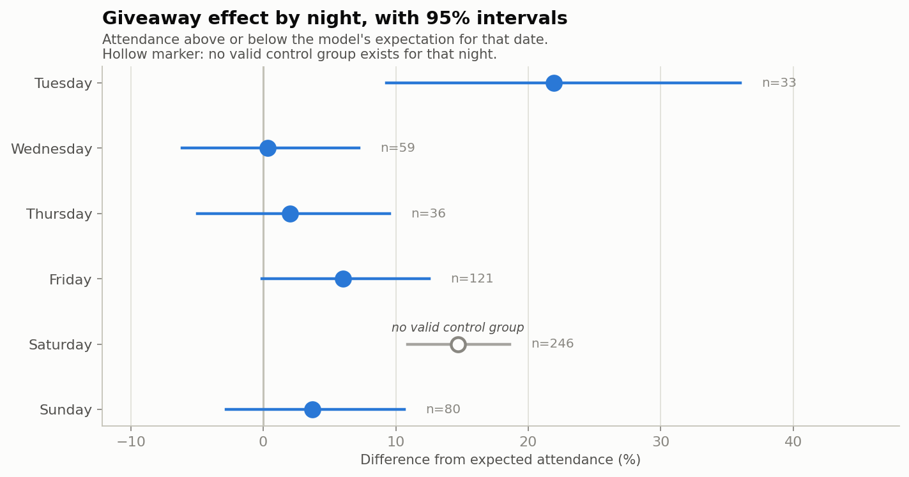
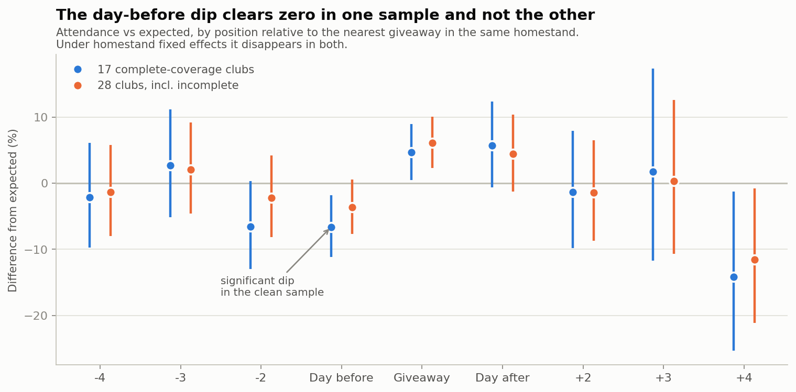
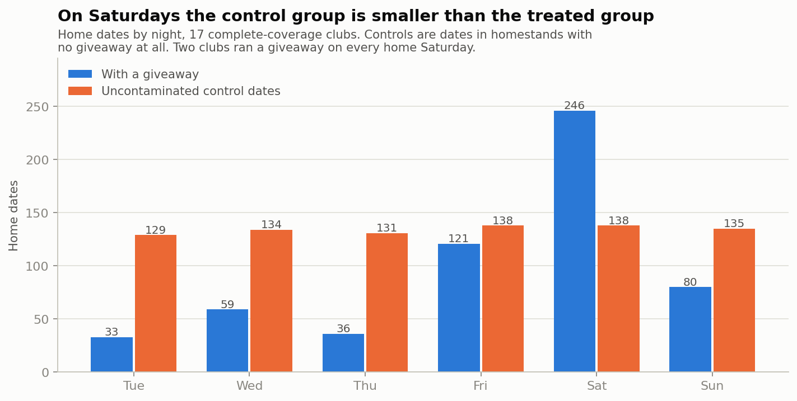
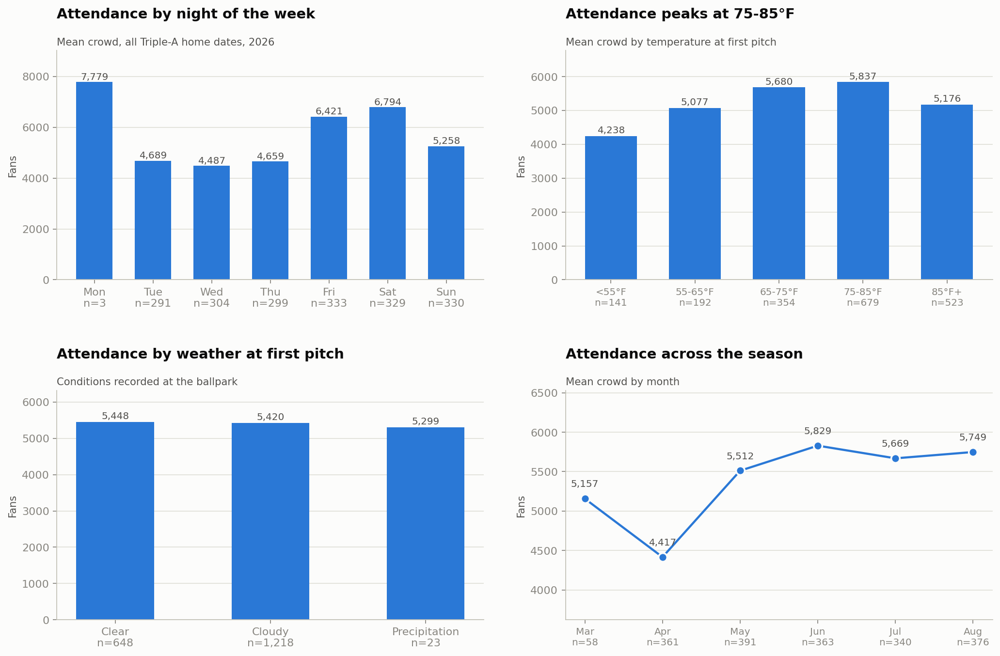
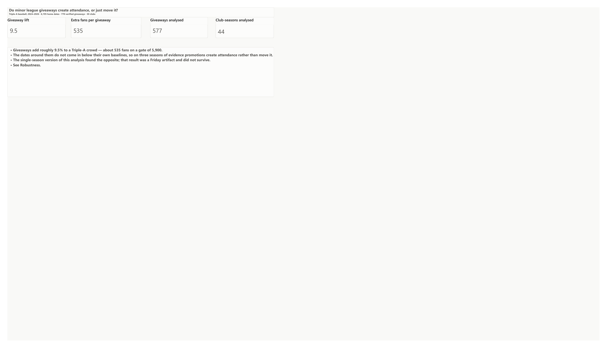
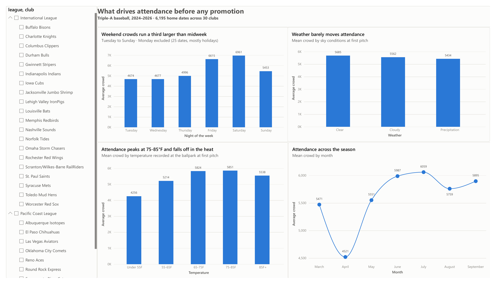
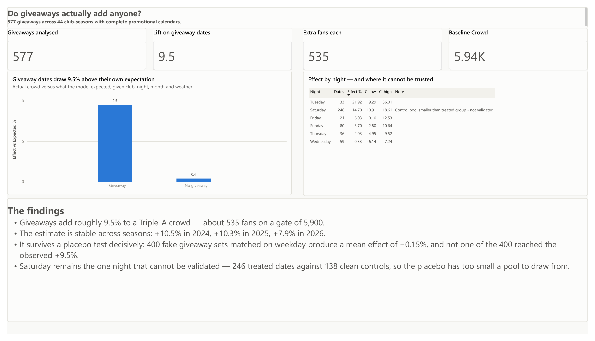
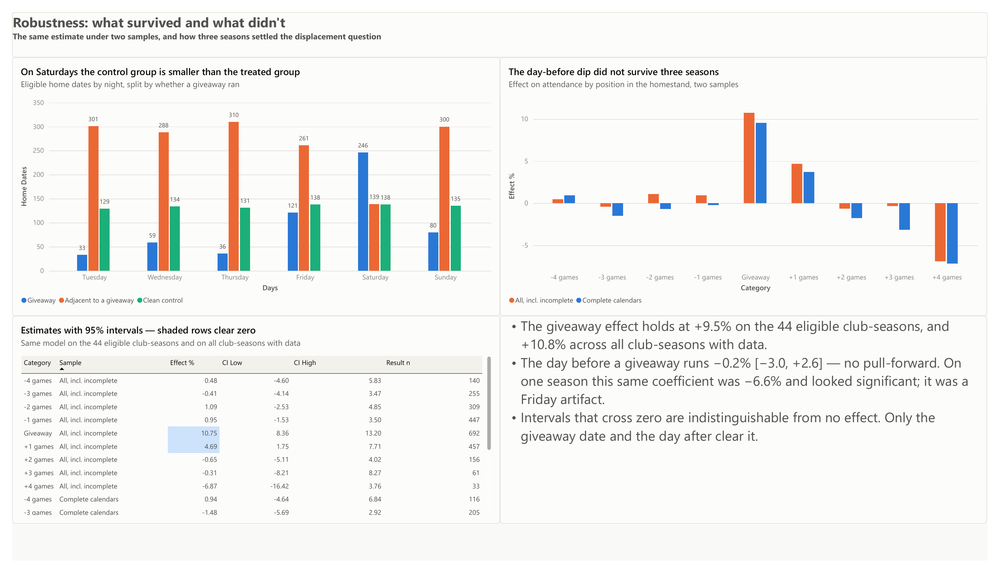
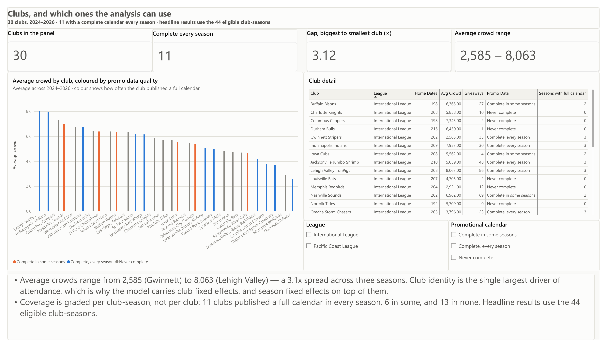

# Do Minor League Giveaways Create Attendance, or Just Move It?

A causal analysis of promotional giveaways across all 30 Triple-A baseball clubs and
three seasons, using game-level attendance, ballpark weather, and hand-verified
promotional calendars.

**Status: complete.** Analysis, five-page Power BI report, and write-up.

**Headline:** giveaways add roughly **9.5%** to a Triple-A crowd — about 570 fans on a
gate of 5,900 — and the surrounding dates do **not** come in below their own baselines.
On this evidence promotions create attendance rather than move it.

The first version of this project ran on one season and could not answer that question.
Two more seasons were collected specifically to break the confound that blocked it. What
changed, and what still cannot be answered, is set out in
[Why one season wasn't enough](#why-one-season-wasnt-enough).

---

## The question

A bobblehead night draws 8,000 fans instead of the usual 5,000. The promotion "worked" —
that is how it gets reported, and it is the number most analyses stop at.

But if the two games on either side of it run 1,000 short of their own baselines, the
club did not create 3,000 fans. It moved them. Same customers, same wallets, different
night, minus the cost of 3,000 bobbleheads.

This project separates the two:

- **Lift** — how much larger is the crowd than that date should have drawn, given the
  club, opponent, day of week, weather, and time of season?
- **Displacement** — do the surrounding games in the same homestand come in *below*
  their own baselines?

## Data

| Source | What it provides | Coverage |
|---|---|---|
| [MLB Stats API](https://statsapi.mlb.com) | Game logs, attendance, ballpark weather at first pitch | 6,750 games, 2024–2026 |
| Club press releases (milb.com, OurSports Central) | Dated giveaway calendars | 770 giveaways, 3 seasons |

Attendance and weather arrive in the same API record, so weather is the reading taken at
the ballpark at first pitch rather than a nearby-station proxy. The API is free and needs
no key. Verified working back to 2012.

**After cleaning:** 6,195 club home dates. 2024 and 2025 are complete seasons; 2026 is
partial, which is why its September giveaways have no game attached.

Giveaway calendars were recovered per club-season from published press releases, each row
carrying the URL it was read from. Coverage is graded **per club-season, not per club** —
a club that published a full calendar in 2024 and only homestand previews in 2025 is
eligible in the first and not the second. That yields **44 eligible club-seasons across
17 clubs: 2,992 home dates and 577 giveaways.**

## Results

### What the data supports

| Specification | Effect on the giveaway date | 95% CI | n |
|---|---|---|---|
| League baseline, eligible club-seasons | **+9.5%** | [+6.9, +12.2] | 577 |
| League baseline, all club-seasons with any data | +10.8% | [+8.4, +13.2] | 692 |
| Within-homestand fixed effects | +9.0% | [+3.2, +15.0] | 530 |
| Within-homestand, midweek giveaways only | +14.7% | [+3.5, +27.3] | 245 |
| Within-homestand, no Saturday giveaways | +14.3% | [+6.0, +23.3] | 145 |

Stable across seasons — +10.5% in 2024, +10.3% in 2025, +7.9% in 2026 — and the placebo
test supports it: 400 fake giveaway sets matched on weekday produce a mean effect of
−0.15% with a standard deviation of 0.66pp. **Not one of the 400 reached the observed
+9.5%.**

In fans, that is roughly **566 extra people on a 5,942 baseline**.



### No displacement

The day before a giveaway sits at or above its own baseline in every specification:

| Specification | Day before | 95% CI |
|---|---|---|
| League baseline | −0.2% | [−3.0, +2.6] |
| Within-homestand | +1.2% | [−3.9, +6.6] |
| Midweek giveaways only | +3.9% | [−6.1, +14.9] |
| No Saturday giveaways | −3.0% | [−10.0, +4.6] |

Nothing here is distinguishable from zero, and the point estimates are as often positive
as negative. Read carefully, this bounds rather than disproves: the midweek interval rules
out pull-forward worse than about −6% on the day before, not displacement of every size.
But the large effect the premise assumed is not there.

The dates *after* a giveaway run mildly high (+3.7% at +1 game). That is consistent with
either a small positive spillover or a homestand simply being a good one; the design
cannot separate those, so no claim is made from it.



### Why one season wasn't enough

The 2024–2026 panel exists because the 2026-only version produced a result that looked
decisive and wasn't. On one season the day before a giveaway showed **−6.6% [−11.2, −1.9]**
— apparent, significant displacement. Under homestand fixed effects the same coefficient
became **+0.15% (p = 0.97)**.

The diagnosis was specific rather than a shrug. Giveaways cluster on Saturdays and
homestands run Tuesday to Sunday, so "the day before a giveaway" was largely a synonym
for "Friday": offset −1 was 41% Friday, offset 0 was 40% Saturday. Position in a homestand
and day of week were close to the same variable, and one season contained no leverage to
separate them.

Two more seasons were collected to fix exactly that, and the mechanism is worth being
precise about — **more rows would not have helped by themselves.** What matters is
**midweek giveaways**, where "the day before" is a Monday, Tuesday or Wednesday and the
confound does not apply. Those went from 49 to 128, which is enough to fit the model on
that subsample alone. That is the row in the results table doing the real work.

The one-season −6.6% was a Friday artifact. It does not survive.

### The structural finding that did not go away

**Saturday still cannot be validated, and three seasons did not fix it.** 246 eligible
Saturdays carried a giveaway against only 138 clean controls — dates with no giveaway
anywhere in the homestand, the only ones a placebo can safely draw from. That is 0.56
controls per treated date. Every other night has between 1.1 and 3.9.

This is the part worth more than either headline. Adding seasons scales the treated group
and the control group together, because clubs schedule Saturday giveaways every year.
Promotional scheduling is concentrated enough that on the single most important night of
the week, the counterfactual barely exists — and no amount of history repairs that. It
would take a club that stopped running Saturday giveaways, or an experiment.



### What actually drives attendance

Before any promotion is involved: night of the week dominates, temperature matters and
peaks at 75-85°F, and conditions barely register once temperature is known.



## Dashboard

Five pages in Power BI, built on a star schema of one fact table and two dimensions.
Full-resolution PDF: [`reports/milb_dashboard.pdf`](reports/milb_dashboard.pdf).

**The answer, first.**



**What moves a crowd before any promotion is involved.** Night of the week dominates;
temperature peaks at 75-85 degrees; sky conditions barely register.



**The giveaway effect, and where it cannot be trusted.** Saturday carries 43% of all
treated dates and is the one night the placebo test cannot validate.



**What survived specification and what did not.** The left chart is why the Saturday
estimate still cannot be validated: on every other night there are two to four clean
controls for each treated date, and on Saturday there are fewer controls than treated.



**Which clubs the analysis can actually use.**



## Design decisions

Each of these came out of something the data actually did.

**The unit of analysis is a home date, not a game.** Games reporting attendance of exactly
zero are all doubleheaders — baseball books the entire gate to one game of the pair. Since
fans buy one ticket for a doubleheader and promotions are advertised per date, the date is
the honest unit.

**Postponed games are returned twice.** A game rained out and made up as part of a
doubleheader comes back under the same `gamePk` twice — once as `Postponed`, once as the
completed makeup. Left alone they would have been double-counted.

**Coverage is graded per club-season.** Carrying one coverage label per club would let a
year of complete data vouch for a year of incomplete data, quietly coding unobserved
giveaways as controls.

**Homestands and week-of-season are scoped to a season.** Without that the last homestand
of one year and the first of the next merge across the winter, since no road game falls
between them.

**Two club-seasons were demoted despite publishing a calendar.** Buffalo 2025 states
giveaways at roughly 35 dates and itemises 13; Nashville 2024 claims 31 and names 21. The
extra dates exist but are unobserved, and an unobserved giveaway coded as a control biases
lift *downward*, so both are excluded from the headline sample rather than trusted.

**Restricted-audience items are not giveaways.** Indianapolis runs a Knot Hole Kids Club
handout for the first few hundred members on 25 dates across 2024–2025. The 2026 file
contains no such items, so including them would have made the treatment definition change
by season.

**Giveaway dates with no played home game are dropped, not shifted.** 21 of 452 historical
dates, 4.6%. Six were cancelled or postponed games, where the date was right and the game
was not played. Several others carry a rain-out signature — Jacksonville's 2025-07-09 has
home dates on 07-08 and *two* on 07-10, a washout made up as a doubleheader. Shifting them
would be inventing treatment assignment, since we cannot know whether the giveaway
travelled to the makeup date.

**The counterfactual is estimated within the panel, on clean controls only.** Dates within
three games of a giveaway are excluded from fitting, so the baseline cannot absorb the
effect it is meant to measure.

## Known limitations

Stated plainly because they bound what the results can claim.

- **Saturday is not placebo-validated,** and it carries 43% of all treated dates. The
  headline survives dropping Saturday entirely (+14.3%), which is the reassurance
  available.
- **Coverage is uneven.** 13 clubs never published a full season calendar in any year.
  Their giveaway counts are undercounts, and they are excluded from headline results and
  reported as a sensitivity check.
- **Iowa 2024 is unrecoverable.** The release is indexed at `/iowa/news/2024-promo-calendar`
  but that URL now 404s.
- **2026 is a partial season.** Its September giveaways have no game attached.
- **No pricing or cost data.** This measures attendance, not profit.
- **Announced attendance is tickets distributed, not turnstile count.** Standard in
  baseball attendance work, and worth stating rather than burying.

See [`docs/data-sources.md`](docs/data-sources.md) for every source evaluated, including
the ones that failed, and [`docs/giveaway-data-quality.md`](docs/giveaway-data-quality.md)
for the full defect log.

## Repository

```
data/
  raw/          API responses and club pages (regenerated by scripts, not committed)
  reference/    giveaways_2024.csv, giveaways_2025.csv, giveaways_2026.csv
                hand-verified, every row carries its source URL
  processed/    analysis-ready tables and the Power BI star schema
src/
  config.py                   paths, league filters, study constants
  extract_games.py            resumable two-pass extractor for game logs and attendance
  fetch_promo_pages.py        club promotions page downloader
  validate_giveaways.py       joins giveaways to the schedule, reports defects
  build_dataset.py            collapses games to home dates, builds homestands and features
  model_baseline.py           the counterfactual: log-linear OLS, club and season fixed effects
  diagnose_model.py           cross-validated fit and weekday-matched placebo test
  model_within_homestand.py   homestand fixed effects, clustered SEs, midweek subsample
  lift_by_weekday.py          per-night lift with per-weekday placebo
  build_bi_tables.py          star schema for Power BI
  make_figures.py             report figures
docs/           source evaluation, data quality, findings, dashboard setup
notebooks/      exploratory analysis
powerbi/        .pbix report and theme
reports/        model output, figures, and dashboard exports
```

## Reproducing

```bash
git clone https://github.com/Shikhar4215/milb-promotion-incrementality.git
cd milb-promotion-incrementality

python3 -m venv .venv && source .venv/bin/activate
pip install -r requirements.txt

python3 src/extract_games.py --seasons 2024 2025 2026   # ~6,750 games, ~45 min, resumable
python3 src/build_dataset.py
python3 src/model_baseline.py
python3 src/diagnose_model.py
python3 src/model_within_homestand.py --midweek
python3 src/build_bi_tables.py
```

`extract_games.py` caches every game to disk and skips what it already has, so an
interrupted run resumes where it stopped. Name every season you want in the interim
files — it rewrites them from the seasons given rather than appending.

## Roadmap

- [x] Source evaluation and feasibility
- [x] Game log, attendance and weather extraction
- [x] Giveaway calendar collection and date validation
- [x] Feature engineering: homestand structure, date dimension
- [x] Baseline attendance model (the counterfactual)
- [x] Lift and displacement estimation, with placebo and specification checks
- [x] Power BI dashboard
- [x] Recover 2024 and 2025 giveaway calendars — the extension that made displacement
      estimable on midweek giveaways
- [ ] A club or season that stopped running Saturday giveaways — the only thing that
      would make the Saturday estimate testable
